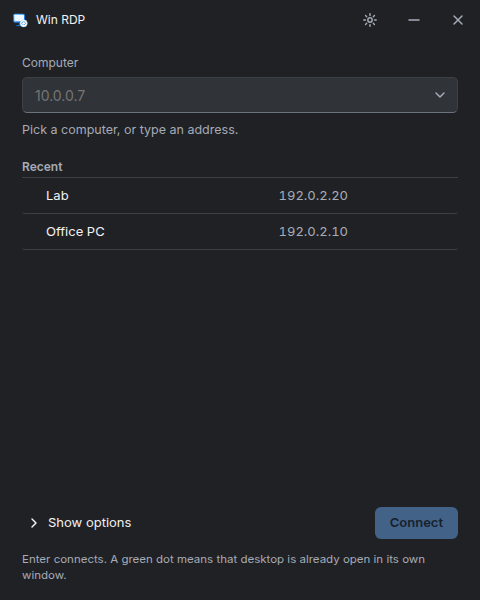

# Win RDP

**Built for speed. Designed for Linux.**

Connect to Windows with a Rust-powered remote desktop client built on IronRDP.
Win RDP brings experimental reliable UDP v1, v2, and v3 transport support,
automatic TCP fallback, and Windows’ graphics pipeline to a native session window,
with clipboard, audio, microphone, and printer redirection.

[Website](https://winrdp.app) · [Releases](https://github.com/AKolenda/winrdp/releases)

Early development: check the release notes for tested platforms and known limitations.

## What is different about it

UDP v1, v2, and v3, powered by Rust. Win RDP’s IronRDP fork implements
experimental reliable UDP transport support alongside TCP:

| Label in the app | Protocol | Spec |
|---|---|---|
| UDP v1 | RDP-UDP, version 1 | [MS-RDPEUDP] |
| UDP v2 | RDP-UDP, version 2 | [MS-RDPEUDP] |
| UDP v3 | RDP-UDP2 | [MS-RDPEUDP2] |
| TCP | plain RDP | [MS-RDPBCGR] |

The launcher offers version 2 first, the version used in the recorded live Windows
tests, and falls back to TCP automatically when UDP cannot be established.
Version 3 uses RDP-UDP2; its implementation still needs live-host validation.
Graphics ([MS-RDPEGFX]) are moved onto the UDP tunnel with a Soft-Sync, so frames
ride the reliable-UDP path with its own retransmit and ACK-vector machinery.

The RDP engine is [IronRDP](https://github.com/Devolutions/IronRDP), a Rust
implementation, through a fork that adds the RDP-UDP transport. The transport work is
being contributed upstream as
[Devolutions/IronRDP#1919](https://github.com/Devolutions/IronRDP/pull/1919).

### Measured on a clean LAN

A local Windows test host, 1280x720, Task Manager open, 60 s per run, 2026-09-07:

| | UDP v2 | TCP |
|---|---|---|
| frames decoded | 426 | 449 |
| mean fps while the screen changes | 20.3 | 21.3 |
| peak fps | 31.5 | 34.8 |
| decode time per frame | 3.9 ms | 4.1 ms |
| tunnel retransmits / reorders | 1 / 0 | n/a |

On a clean LAN the two are at parity: frame rate is bounded by how often the remote
screen changes, not by the transport. The UDP transport targets lossy and
high-latency links; a performance advantage on those networks has not yet been
established by these measurements. To compare on your own network, run the session binary
with `IRONRDP_UDP=1` and with `IRONRDP_UDP=0`, then grep `session perf` in the logs.

## The launcher

Two layouts, chosen in Settings.

**Simple** is the default: one small window, the way the Windows client is. Pick a
computer or type an address, press Enter. Every desktop opens in its own window.



**Full** adds a sidebar, search, and tabs, and can open a desktop in a tab inside the
launcher using the classic FreeRDP engine.


### Session window

- Windows 11 style connection bar in full screen: pin, restore, close, transport label.
- Resizing the window resizes the remote desktop through Display Control.
- Closing asks first, the way mstsc does; the remote session stays signed in.
- Clipboard sharing supports text and images on X11 and Wayland; enable it per computer.
  Desktop clipboard integration and Windows policy can affect availability.
- Microphone redirection ([MS-RDPEAI]) and a redirected printer ([MS-RDPEPC]) are per
  computer, under Edit. Print jobs go to the local default printer through CUPS, or to
  `~/Downloads` as PostScript when there is no printer.

Windows only opens the microphone channel when its policy allows audio recording
redirection (Group Policy: Remote Desktop Session Host, Device and Resource Redirection,
"Allow audio recording redirection").

## Build

See [BUILDING.md](BUILDING.md) for prerequisites. Then:

```sh
bash scripts/build-deb.sh
sudo apt install ./dist/winrdp-next_0.7.4_amd64.deb
```

The package installs `winrdp-next` (the launcher) and `winrdp-session` (one process per
desktop) and leaves any other RDP client on the machine alone.

## Layout of the repository

| Path | What it is |
|---|---|
| `frontend/` | The launcher UI: plain HTML, CSS, and JavaScript, no framework. |
| `src-tauri/` | The launcher shell: Tauri, plus the classic in-window FreeRDP engine bridge. |
| `session/` | `winrdp-session`, the IronRDP-based session window. |
| `third_party/ironrdp/` | The IronRDP fork with RDP-UDP, the Linux clipboard backend, and the printer backend. |
| `design/` | Launcher design concepts, as static HTML. |
| `website/` | Static release website; download links go to GitHub Releases. |

## Hosting

Win RDP is a client, but it sets up the host side for you. Settings has a switch,
"Accept connections from Windows", that configures GNOME Remote Desktop to mirror the
desktop you are signed in to on port 3389, on now and at every sign-in, whether or not
Win RDP is running. It also turns off GNOME's headless "Remote Login" mode, which would
give Windows a separate login session instead of your screen. Hosting is opt-in: opening the launcher never enables inbound RDP. Enable it explicitly in Settings. Two modes: "Show my screen" mirrors the monitor and needs it on;
"Virtual screen" gives the same signed-in session its own screen and works with the
monitor off or unplugged. Connections into the machine are TCP; hosting over RDP-UDP is
not built yet.

[MS-RDPEUDP]: https://learn.microsoft.com/en-us/openspecs/windows_protocols/ms-rdpeudp/
[MS-RDPEUDP2]: https://learn.microsoft.com/en-us/openspecs/windows_protocols/ms-rdpeudp2/
[MS-RDPBCGR]: https://learn.microsoft.com/en-us/openspecs/windows_protocols/ms-rdpbcgr/
[MS-RDPEGFX]: https://learn.microsoft.com/en-us/openspecs/windows_protocols/ms-rdpegfx/
[MS-RDPEAI]: https://learn.microsoft.com/en-us/openspecs/windows_protocols/ms-rdpeai/
[MS-RDPEPC]: https://learn.microsoft.com/en-us/openspecs/windows_protocols/ms-rdpepc/
